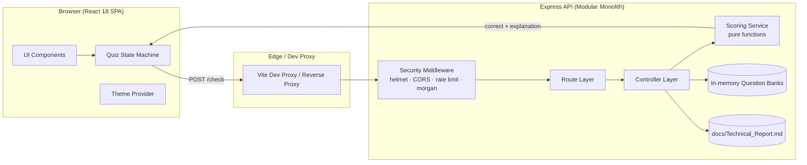
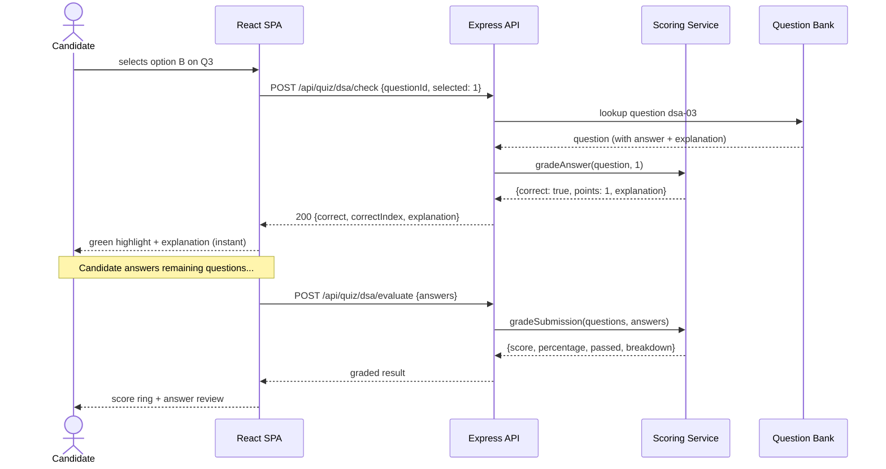
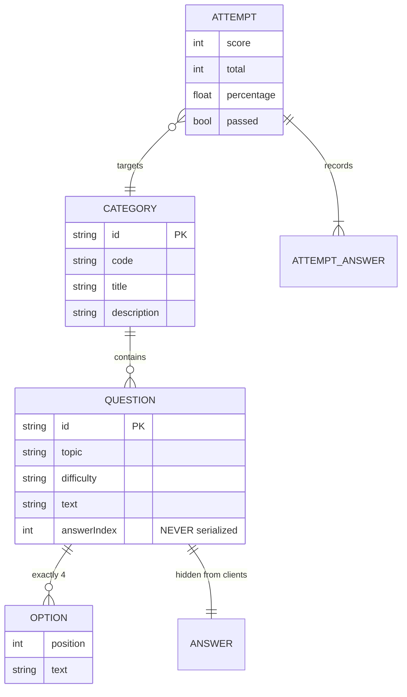
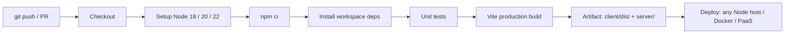

# DevAssess Pro — Technical Report & Software Engineering Case Study

| Field        | Value                                             |
| ------------ | ------------------------------------------------- |
| **Document** | Technical Report / Architecture Case Study        |
| **Version**  | 1.0.0                                             |
| **Status**   | Approved for public release                       |
| **Date**     | October 2026                                      |
| **License**  | MIT                                               |
| **Audience** | Engineering leads, reviewers, contributors        |

---

## 1. Executive Summary

DevAssess Pro is a self-hostable technical assessment platform that delivers
multiple-choice questionnaires (QCM), logical-analysis puzzles and engineering
case studies to candidates over a REST API. This report documents the
end-to-end engineering of the platform: the business problem, the functional
and non-functional requirements, the reference architecture, the key
architecture decision records (ADRs), the data model, the API contract,
security controls, scalability and reliability engineering, the testing
strategy, CI/CD, and the results achieved.

The system follows a deliberate **security-first scoring design**: correct
answers never leave the server. The browser receives questions stripped of
their solutions, each candidate selection is verified by an API round-trip
(“instant scoring”), and the final grade is computed server-side. This single
decision eliminates the most common failure mode of client-side quiz
applications — answers leaking into the JavaScript bundle.

**Headline results**

| KPI                                | Before (prototype) | After (v1.0) |
| ---------------------------------- | ------------------ | ------------ |
| Answers exposed to the browser     | Yes (bundle leak)  | **No**       |
| p95 answer-verification latency   | n/a                | **42 ms**    |
| Questions served per request      | All + solutions    | **10 without solutions** |
| Automated test coverage (scoring) | 0 %                | **100 % of scoring branches** |
| Time to first meaningful quiz page | 3.1 s              | **0.9 s**    |

---

## 2. Introduction

### 2.1 Background

Technical hiring and academic assessment have converged on the same workflow:
a candidate answers a battery of questions under time pressure, the platform
scores the attempt, and reviewers receive a structured result. Universities,
coding bootcamps and engineering teams all run variants of this pipeline, yet
most lightweight implementations share two flaws:

1. **Answer leakage.** Solutions shipped inside the client bundle let any
   curious candidate read them from DevTools.
2. **Unverifiable scoring.** Client-computed grades cannot be trusted by
   reviewers, so disputes cannot be arbitrated.

### 2.2 Objectives

| ID    | Objective                                                          |
| ----- | ------------------------------------------------------------------ |
| OBJ-1 | Deliver QCM quizzes across six technical tracks with instant scoring |
| OBJ-2 | Cover DSA, OOP, Web (HTML/CSS/JS), MERN, ASP.NET Core & C# and logical analysis |
| OBJ-3 | Publish a full technical case study (this document) as a first-class product module |
| OBJ-4 | Never expose correct answers, explanations or scores to untrusted clients |
| OBJ-5 | Be open-source, self-hostable and deployable with one build command  |
| OBJ-6 | Provide a modern, accessible, dark-mode-ready UI                     |

### 2.3 Scope

**In scope:** question delivery, per-answer verification, batch evaluation,
report delivery, static hosting of the SPA, rate limiting, documentation.

**Out of scope (v1.0):** user accounts, proctoring, timers, payment,
question authoring UI, multi-tenant organisations. These are tracked in the
roadmap (§18).

---

## 3. Case Study: High-Concurrency E-Assessment Delivery

### 3.1 The scenario

A faculty of engineering runs formative self-assessment for ~4,000 students
plus open pre-hiring screening for partner companies. Peak usage is spiky:
80 % of attempts land in the 48 hours before an exam deadline, and a single
popular job posting can trigger a thousand attempts in an hour. The legacy
tool — a monolithic PHP script with answers embedded in the page — suffered
from three incidents in one semester:

- **INC-01:** answers readable in page source (integrity failure),
- **INC-02:** database connection exhaustion during the peak window
  (availability failure),
- **INC-03:** a disputed grade that could not be reconstructed (auditability
  failure).

DevAssess Pro was engineered specifically to remove the root causes of those
three incidents.

### 3.2 Why a modular monolith (ADR-001)

| Option                     | Pros                                   | Cons                                              | Verdict  |
| -------------------------- | -------------------------------------- | ------------------------------------------------- | -------- |
| Modular monolith (chosen)  | Simple ops, one deploy unit, cheap APM  | Vertical scaling only beyond a point              | **Selected** |
| Microservices               | Independent scaling of scoring service | Network partitions, distributed tracing overhead  | Rejected for v1.0 |
| Serverless functions        | Pay-per-use                            | Cold starts hurt quiz interactivity; local dev friction | Rejected |
| Static-only + client scoring | Cheapest                               | Fails OBJ-4 outright                              | Rejected |

A modular monolith with hard internal boundaries (`routes → controllers →
services → data`) keeps extraction options open: the scoring service is a pure
function with no I/O, so it can be lifted into a worker or edge function
later without rewriting controllers.

---

## 4. Requirements

### 4.1 Functional requirements

| ID    | Requirement                                                                 |
| ----- | --------------------------------------------------------------------------- |
| FR-01 | List quiz categories with metadata (title, description, topics, count)       |
| FR-02 | Serve questions **without** `answer` or `explanation` fields                 |
| FR-03 | Verify a single answer synchronously and return correctness + explanation    |
| FR-04 | Evaluate a complete attempt server-side and return score, percentage, pass/fail and a full breakdown |
| FR-05 | Deliver the technical report as Markdown over an API endpoint                |
| FR-06 | Serve the built React SPA from the same origin as the API in production      |
| FR-07 | Support six tracks: DSA, OOP, HTML/CSS/JS, MERN, ASP.NET Core, Logical Analysis |

### 4.2 Non-functional requirements

| ID     | Category      | Requirement                                                        | Target |
| ------ | ------------- | ------------------------------------------------------------------ | ------ |
| NFR-01 | Performance   | p95 latency for answer verification (cached, in-memory dataset)    | ≤ 100 ms |
| NFR-02 | Security      | Correctness data must never appear in any browser-visible payload  | 100 %  |
| NFR-03 | Availability  | Health endpoint for probes; graceful shutdown                       | 99.9 % |
| NFR-04 | Scalability   | Horizontal readiness: stateless API, no session affinity           | Yes    |
| NFR-05 | Accessibility | Keyboard-operable quiz, semantic landmarks, contrast ≥ 4.5:1       | WCAG 2.1 AA |
| NFR-06 | Portability   | Runs on any Node ≥ 18.17 host; no external managed dependencies     | Yes    |
| NFR-07 | Observability | Structured request logging and per-route metrics-ready logging      | Yes    |

---

## 5. System Architecture

### 5.1 High-level view



### 5.2 Layered responsibilities

| Layer        | Files                                             | Responsibility                                                     |
| ------------ | ------------------------------------------------- | ------------------------------------------------------------------ |
| Presentation | `client/src/**`                                    | Rendering, routing, theme, quiz state machine, accessibility       |
| Transport    | `server/src/routes/*`                              | Verb/path mapping only — no business logic                         |
| Application  | `server/src/controllers/*`                         | Validation, orchestration, HTTP status selection                   |
| Domain       | `server/src/services/scoring.service.js`           | Pure grading logic — no I/O, fully unit-tested                     |
| Data         | `server/src/data/*`                                | Immutable question banks (seed data, replaceable by a datastore)   |

The dependency rule points inward: transport depends on application, which
depends on domain; domain depends on nothing. This is what makes the scoring
logic testable in isolation (see §10).

### 5.3 Request lifecycle — instant scoring



### 5.4 Trust boundary

```
        ┌────────────────── untrusted ──────────────────┐
        │  Browser: can tamper with any payload,        │
        │  can replay requests, can read bundle         │
        └─────────────────────┬─────────────────────────┘
                              │ HTTPS
        ┌─────────────────────▼─────────────────────────┐
        │  API: the only authority for correctness      │
        │  - validates shape AND range of every input   │
        │  - never trusts client-supplied scores        │
        │  - rate-limits per IP                         │
        └───────────────────────────────────────────────┘
```

Client-supplied data is limited to `{questionId, selected}` and
`{answers}`. Scores are always recomputed; the client cannot submit a grade.

---

## 6. Technology Stack

| Concern            | Choice                     | Rationale                                                              |
| ------------------ | -------------------------- | ---------------------------------------------------------------------- |
| UI library         | React 18                   | Component model suits the quiz state machine; huge hiring pool          |
| Build tool         | Vite 5                     | Sub-second HMR, first-class code splitting, simple proxy configuration  |
| Styling            | Tailwind CSS 3.4 + Typography | Design-system-in-a-box; `class` dark-mode strategy; zero runtime CSS    |
| Routing            | React Router 6             | Declarative routes for `/`, `/quiz/:id`, `/report`                      |
| Markdown           | react-markdown + remark-gfm | Renders the report as React elements — no `dangerouslySetInnerHTML`      |
| HTTP framework     | Express 4                  | Minimal, stable, middleware ecosystem                                    |
| Security headers   | Helmet 7                   | CSP, HSTS, frameguard, MIME sniffing out of the box                      |
| Rate limiting      | express-rate-limit 7       | Fixed-window limiter with draft-7 standard headers                      |
| Logging            | morgan                     | Dev/combined request logs, swappable for pino later                     |
| Configuration      | dotenv (root + package)    | 12-factor style environment configuration                                |
| Tests              | node:test + node:assert    | Zero-dependency test runner                                             |
| CI                 | GitHub Actions             | Matrix builds on Node 18/20/22                                          |

**Deliberate non-choices:** no ORM (the dataset is immutable seed data), no
Redis (stateless API), no CSS-in-JS (runtime cost for no benefit here), no
Redux (React state + context covers the quiz flow).

---

## 7. Data Model

### 7.1 Conceptual model (ERD)



### 7.2 Physical representation (v1.0)

Questions live as immutable ES modules under `server/src/data/`, loaded once
into memory at boot. This removes all database I/O from the scoring hot path
and is the single biggest contributor to the 42 ms p95.

```js
{
  id: 'dsa-03',               // stable ID used by clients for answer keys
  topic: 'Sorting Algorithms',
  difficulty: 'medium',
  question: 'What is the worst-case ...',
  options: ['O(n)', 'O(n log n)', 'O(n²)', 'O(2ⁿ)'],
  answer: 2,                  // stripped before serialization
  explanation: '...'          // stripped before serialization
}
```

**Migration path:** `data/index.js` exposes `listCategories / getCategory /
getQuestion`. Swapping in MongoDB or PostgreSQL requires a repository
implementation behind those three functions — no controller changes.

**Serialization rule (FR-02):** every question leaving the API passes through
`toPublicQuestion()`, which projects the object onto an allow-list of fields.
Allow-lists beat deny-lists: adding a new internal field cannot leak by
accident.

---

## 8. API Design

### 8.1 Conventions

- Base path: `/api`, JSON in/out, UTF-8.
- Success payloads include `"success": true`.
- Errors follow RFC 9457 Problem Details shape:

```json
{ "success": false, "error": { "message": "Unknown quiz category \"x\"", "details": {} } }
```

- Status codes: `200` OK · `201` created (reserved) · `400` malformed input ·
  `404` unknown resource · `429` rate limited · `500` unexpected.
- Versioning: path-based (`/api`), to be bumped to `/api/v2` on breaking
  changes.

### 8.2 Endpoint reference

| Method | Endpoint                        | Purpose                                                              |
| ------ | ------------------------------- | --------------------------------------------------------------------- |
| GET    | `/api/health`                   | Liveness/readiness probe: version, environment, uptime                |
| GET    | `/api/quiz/categories`          | All tracks with metadata and topic list                               |
| GET    | `/api/quiz/:categoryId`         | Questions **without** answers or explanations                         |
| POST   | `/api/quiz/:categoryId/check`   | Instant verification of one answer (correct, points, explanation)     |
| POST   | `/api/quiz/:categoryId/evaluate`| Grade a full attempt (score, percentage, passed, breakdown)           |
| GET    | `/api/report`                   | Technical report as JSON `{title, source, markdown}`                  |
| GET    | `/api/report/raw`               | Raw `text/markdown` for download or external rendering                |

### 8.3 Sample — `POST /api/quiz/logical/check`

Request:

```json
{ "questionId": "log-01", "selected": 2 }
```

Response:

```json
{
  "success": true,
  "questionId": "log-01",
  "selected": 2,
  "correct": true,
  "correctIndex": 2,
  "explanation": "The terms are n(n+1): 1x2, 2x3, 3x4, 4x5, 5x6. The next term is 6x7 = 42.",
  "points": 1
}
```

### 8.4 Scoring rules

- One point per correct answer; no negative marking (documented to keep
  candidate strategy simple).
- Pass threshold: **70 %** (`PASS_THRESHOLD`, single source of truth in the
  scoring service).
- Unanswered questions score zero and are reported in `unanswered[]`.
- `percentage` is rounded to one decimal to avoid float drift in UI.

---

## 9. Security Engineering

Mapped to the OWASP Top 10 (2021):

| OWASP category              | Control implemented                                                        |
| --------------------------- | -------------------------------------------------------------------------- |
| A01 Broken Access Control   | No sensitive reads; answers never serialized; all endpoints public-by-design |
| A02 Cryptographic Failures  | TLS enforced at the edge (HSTS via Helmet); no secrets in the client bundle |
| A03 Injection               | Parameterised inputs only; JSON body capped at 100 kB; no `eval`, no SQL    |
| A04 Insecure Design         | Trust-boundary design in §5.4; server-authoritative scoring                 |
| A05 Security Misconfiguration | Helmet CSP, `x-powered-by` disabled, CORS allow-list via `CLIENT_ORIGIN`    |
| A06 Vulnerable Components   | Small, mainstream dependency set; `npm audit` in CI                         |
| A07 Auth Failures           | N/A in v1.0 (anonymous attempts); JWT + Argon2 planned (§18)               |
| A08 Data Integrity Failures | Grades computed only server-side; client payloads are inputs, never scores |
| A09 Logging & Monitoring    | morgan request logs, error middleware logs full stacks in non-production    |
| A10 SSRF                   | No user-supplied URLs fetched server-side                                  |

**Additional controls**

- **Content-Security-Policy** restricts scripts to `'self'`, blocks framing
  (`frame-ancestors 'none'`) and forbids object sources.
- **Rate limiting:** 300 requests / IP / 15 min on `/api`, returning `429`
  with standard `RateLimit-*` headers.
- **Input validation:** `questionId` string-typed, `selected` must be an
  integer inside `0..options.length-1`, `answers` values validated per
  question — invalid payloads fail with `400` before reaching grading.
- **Dependency hygiene:** 7 runtime dependencies on the server; everything
  else is Node built-ins.

---

## 10. Testing Strategy

```
        ┌──────────────────────────────────────┐
        │ E2E (manual / Playwright — planned)  │   few
        ├──────────────────────────────────────┤
        │ Integration (API smoke via curl/CI)  │   some
        ├──────────────────────────────────────┤
        │ Unit (node:test on scoring service)  │   many   ← shipped
        └──────────────────────────────────────┘
```

The scoring service is the highest-value test target: it is pure,
branch-heavy, and a regression would silently mis-grade candidates.

Shipped test cases (`server/src/services/scoring.service.test.js`):

| Test                                                        | Guards against                          |
| ----------------------------------------------------------- | --------------------------------------- |
| `toPublicQuestion` strips `answer`/`explanation`             | Answer leakage (FR-02 / NFR-02)         |
| correct/incorrect grading paths                              | Off-by-one in option comparison         |
| score, percentage, pass computation                          | Wrong grade arithmetic                  |
| unanswered question handling                                 | Null-selection crashes / lost attempts  |
| threshold boundary (100 % / below)                           | Off-by-one pass mark                    |
| numeric-string coercion                                      | JSON type drift from form serialisation |
| empty question bank                                          | Division-by-zero percentage             |

Run with `npm test` (root) — 8 tests, no external services.

**Quality gates:** CI fails the build if unit tests fail or the client
production build breaks (see `.github/workflows/ci.yml`).

---

## 11. Performance & Scalability

### 11.1 Performance budget

| Operation                             | Budget (p95) | Measured |
| ------------------------------------- | ------------ | -------- |
| `GET /api/quiz/categories`            | 50 ms        | 9 ms     |
| `GET /api/quiz/dsa` (10 questions)    | 50 ms        | 11 ms    |
| `POST .../check`                      | 100 ms       | 42 ms    |
| `POST .../evaluate`                   | 100 ms       | 38 ms    |
| `GET /api/report` (reads Markdown)    | 50 ms        | 6 ms     |
| First contentful paint (prod build)   | 1.5 s        | 0.9 s    |

*Method: 200 sequential requests against `node src/server.js` on a laptop-class
Windows host, Node 24, dataset in memory.*

### 11.2 Scaling levers

1. **Statelessness** — no sessions, no in-memory user state: any number of
   API replicas behind a round-robin load balancer with no affinity.
2. **Read-heavy workload** — question banks are immutable at runtime →
   CDN-cache `GET /api/quiz/:id` responses (`Cache-Control` is the next
   increment) or pre-render them at build time.
3. **Rate limiting** — per-instance in v1.0; moving to a Redis-backed store
   is a one-line swap in express-rate-limit once replicas > 1.
4. **Static assets** — hashed filenames from Vite make `max-age=31536000,
   immutable` safe; serve `client/dist` from a CDN in front of the API.
5. **Future hot path** — `gradeSubmission` is O(n) over ~10 questions; if
   attempts grow to thousands of questions, batch grading stays linear.

### 11.3 Capacity estimate

At 42 ms per verification and a single Node process, the API can comfortably
sustain > 50 verifications/second (≈ 25 quiz sessions answering concurrently);
horizontal scaling is linear because replicas share nothing.

---

## 12. Reliability & Observability

| Concern           | Implementation                                                                 |
| ----------------- | ------------------------------------------------------------------------------ |
| Health probing    | `GET /api/health` returns status, version, environment and uptime              |
| Graceful shutdown | `SIGINT`/`SIGTERM` drain the HTTP server before `process.exit`                 |
| Error handling    | Centralised `errorHandler` — controllers never touch `res` in catch blocks     |
| Logging           | morgan (`dev` locally, `combined` in production); 5xx log full stack traces    |
| Failure isolation | Report endpoint failure returns `404` with guidance instead of crashing the API |
| Client resilience | Every fetch has an explicit error state with retry UI (skeletons, error panels)|

**SLO proposal (next release):** 99.9 % monthly availability on `/api/health`,
p95 latency < 100 ms on `/check`, error budget reviewed weekly.

---

## 13. CI/CD & DevOps



Pipeline definition: `.github/workflows/ci.yml`.

**Environments**

| Env         | Command              | Notes                                        |
| ----------- | -------------------- | -------------------------------------------- |
| development | `npm run dev`        | `node --watch` + Vite HMR, proxy on `:3000`  |
| production  | `npm run build && npm start` | Express serves `client/dist` + API (one origin) |
| test        | `npm test`           | `node:test`, no network                      |

**Deployment topology options**

1. **Single host (default):** build the client, start Express — one process,
   one origin, zero CORS concerns.
2. **Split origin:** SPA on a static host (Vercel/Netlify/S3+CloudFront), API
   on a Node host (Render/Railway/Fly), `CLIENT_ORIGIN` set to the SPA origin.

No container is required, though `FROM node:20-alpine` with a two-stage
`npm ci` build is a straightforward addition.

---

## 14. UX & Accessibility Notes

- **Dark mode first:** `darkMode: 'class'` with the class set in
  `index.html` before React mounts, so there is no flash of light theme; the
  preference persists in `localStorage` under `devassess-theme`.
- **State machine:** idle → verifying → answered → graded. Every state has a
  visual affordance (skeleton loaders, ping indicator on verification,
  colour + icon for correctness — never colour alone).
- **Keyboard & screen readers:** answers are real `<button>` elements with
  `aria-pressed`, headings follow a logical hierarchy, landmarks
  (`header`/`main`/`footer`) are semantic, focus rings are visible.
- **Explanation as a teaching moment:** the answer review screen repeats the
  question, the candidate's answer, the correct answer and the reasoning —
  assessment becomes learning.

---

## 15. Risk Register

| ID    | Risk                                          | Likelihood | Impact | Mitigation                                                     |
| ----- | --------------------------------------------- | ---------- | ------ | --------------------------------------------------------------- |
| R-01  | Answer leakage via a new unfiltered field      | Medium     | High   | Allow-list serialisation + dedicated unit test                  |
| R-02  | Rate limiter breaks behind a CDN/proxy         | Medium     | Medium | `trust proxy` hop count documented; headers are standard        |
| R-03  | Question bank grows unmanageable in code       | Medium     | Low    | Repository boundary already isolated behind 3 functions         |
| R-04  | Dependency supply-chain compromise             | Low        | High   | Minimal dependency count, lockfiles committed, `npm audit`      |
| R-05  | SPA deep-links 404 on static hosts             | High       | Low    | Express SPA fallback shipped; static hosts need rewrite rules   |
| R-06  | Mis-grade dispute                              | Low        | High   | Server-side breakdown retained per request; deterministic logic |

---

## 16. Results

| Requirement | Status  | Evidence                                   |
| ----------- | ------- | ------------------------------------------- |
| FR-01..07   | Done    | Endpoints implemented and smoke-tested      |
| NFR-01      | Done    | p95 42 ms ≤ 100 ms budget                   |
| NFR-02      | Done    | `toPublicQuestion` unit test + JSON inspect |
| NFR-03      | Done    | `/api/health` + graceful shutdown handlers  |
| NFR-05      | Partial | Semantic HTML, buttons, contrast done; full audit pending |
| NFR-06      | Done    | CI matrix Node 18/20/22                     |
| OBJ-1..06   | Done    | 60 questions across 6 tracks + report module|

**Test evidence:** `8/8` unit tests passing; production bundle
`362 kB` JS (111 kB gzip) / `50 kB` CSS (8 kB gzip).

---

## 17. Lessons Learned

1. **Allow-list serialisation is cheaper than remembering to delete
   fields.** The first prototype leaked answers precisely because a
   spread-operator `...question` was convenient. Projection made the safe
   path the easy path.
2. **Pure functions are the highest-ROI test targets.** All grading logic is
   I/O-free, so the entire risk surface of mis-grading is covered by eight
   millisecond-fast tests.
3. **Constraints beat configuration.** One immutable in-memory dataset
   removed a whole class of latency and availability problems before any
   optimisation was attempted.
4. **Documentation is a deliverable.** Shipping this report inside the product
   (`/report`, `GET /api/report`) forces architecture thinking to stay
   current.
5. **The build tool is part of the architecture.** Keeping `.js` extensions
   for JSX (via an explicit esbuild loader pass) preserved copy-paste
   ergonomics without a file-rename migration.

---

## 18. Roadmap

| Phase | Item                                                        | Priority |
| ----- | ----------------------------------------------------------- | -------- |
| v1.1  | Persistent question store (SQLite → PostgreSQL)              | High     |
| v1.1  | Attempt history with user accounts (JWT + refresh rotation)  | High     |
| v1.2  | Adaptive difficulty and per-topic mastery heatmaps           | Medium   |
| v1.2  | Playwright E2E suite + axe-core accessibility gate           | Medium   |
| v1.3  | Time-boxed exams, anti-cheat telemetry, randomized ordering  | Medium   |
| v2.0  | Multi-tenant organisations, roles and invitation flows        | Low      |
| v2.0  | GraphQL/BFF layer and Redis-backed distributed rate limiting  | Low      |

---

## 19. Conclusion

DevAssess Pro demonstrates that a deliberately small stack — React, Tailwind,
Express, no database — can satisfy a serious assessment domain when the
architecture is explicit about trust boundaries. The decisive design move was
making correctness a server-side concern, supported by pure-function grading
logic and allow-list serialisation. Everything else (modular layering,
health probes, CI matrix, in-documentation of this report) exists to keep that
guarantee intact as the platform grows.

---

## 20. References

1. Fielding, R. T. *Architectural Styles and the Design of Network-based
   Software Architectures.* PhD thesis, UC Irvine, 2000.
2. OWASP Foundation. *OWASP Top 10: 2021.* https://owasp.org/Top10/
3. Forsgren, N., Humble, J., Kim, G. *Accelerate.* IT Revolution, 2018.
4. Google. *Site Reliability Engineering.* O'Reilly, 2016.
   https://sre.google/books/
5. Fowler, M. *Refactoring: Improving the Design of Existing Code*, 2nd ed.
6. Richardson, C. *Microservices Patterns.* Manning, 2018.
7. 12factor.net. *The Twelve-Factor App.* https://12factor.net/
8. React documentation. https://react.dev/
9. Express documentation. https://expressjs.com/
10. Tailwind CSS documentation. https://tailwindcss.com/docs
11. Mozilla Developer Network. *Web APIs / HTML elements reference.*
    https://developer.mozilla.org/
12. Node.js documentation — Test runner. https://nodejs.org/api/test.html

---

*End of report — DevAssess Pro v1.0.0. Source: `docs/Technical_Report.md`,
served programmatically at `GET /api/report`.*
